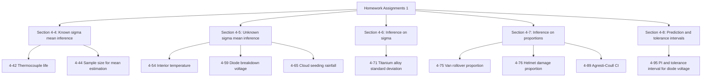

# Homework Assignments 1 — 完整擷取與 HackMD 校對版

###### tags: `Statistics` `Homework` `PDF extraction` `Hypothesis testing` `Confidence interval`

> 來源：`Homework Assignments 1.pdf`  
> 整理目的：將 PDF 中每一頁的題目文字、數字、統計符號與頁尾章節資訊重新整理成可直接複製到 HackMD 的 Markdown。  
> 校對原則：以 PDF 頁面影像為主、OCR 文字為輔。所有容易被 OCR 誤判的統計符號，例如 $\sigma$、$\mu$、$\alpha$、$\beta$、$p$、$H_0$、$H_1$，已手動還原成 HackMD / MathJax 可正確渲染的形式。

[TOC]

---

## 一、整體題目主題圖



---

## 二、校對重點與疑似原文／掃描異常

| 頁碼 | 題號 | 校對重點 | 本文件處理方式 |
|---:|---:|---|---|
| 1 | 4-42 | OCR 容易把 $\sigma$ 誤成 `er`，把 $\alpha$ 誤成 `a`，把 $\beta$ 誤成 `~` 或 `B`。 | 依頁面影像修正為 $\sigma = 20$、$\alpha = 0.05$、$\beta$-value、$\beta$ does not exceed 0.10。 |
| 3 | 4-54 | part (d) 影像中 `at least 0.9` 附近有藍色游標／標註痕跡，OCR 可能讀成 `a least 0.9`。 | 依英文語意與頁面脈絡校正為 `at least 0.9`。 |
| 5 | 4-65 | part (e) 原頁面可見文字是 `mean diameter`，但全題主題是 rainfall。 | 忠實保留 `mean diameter`，並註明此處疑似原教材或掃描來源誤植；實際解題時很可能應理解為 `mean rainfall`。 |
| 6 | 4-71 | OCR 容易把 $\sigma$ 誤成 `u` 或其他字元。 | 依頁面影像修正為 $\sigma$。 |
| 7 | 4-75 | OCR 容易把 $\beta$ 誤成 `~`，且 `if we want β = 0.10` 可能被連成一段。 | 依頁面影像修正為 $\beta$-error 與 $\beta = 0.10$。 |
| 8 | 4-76 | OCR 可能把 `p is` 連成 `pis`。 | 修正為 `p is`。 |

---

## 三、逐頁完整轉錄

---

## Page 1 / 10

### Exercise 4-42

**4-42.** The life in hours of a thermocouple used in a furnace is known to be approximately normally distributed, with standard deviation $\sigma = 20$ hours. A random sample of 15 thermocouples resulted in the following data:

553, 552, 567, 579, 550, 541, 537, 553, 552, 546, 538, 553, 581, 539, 529.

(a) Is there evidence to support the claim that mean life exceeds 540 hours? Use a fixed-level test with $\alpha = 0.05$.

(b) What is the $P$-value for this test?

(c) What is the $\beta$-value for this test if the true mean life is 560 hours?

(d) What sample size would be required to ensure that $\beta$ does not exceed 0.10 if the true mean life is 560 hours?

(e) Construct a 95% one-sided lower CI on the mean life.

(f) Use the CI found in part (e) to test the hypothesis.

**Footer:** EXERCISES FOR SECTION 4-4

**Page number:** 1

### Page 1 image notes

- 題號 **4-42.** 以綠色顯示。
- 黃色標記包含：`529`、`claim`、$\alpha$、$\beta$、`sample`、以及 part (d) 中的 $\beta$。
- 此頁沒有圖表，只有題目文字與標記。
- 重要數字：$\sigma = 20$、$n = 15$、$\alpha = 0.05$、比較值 540、假設真實平均數 560、$\beta \le 0.10$、95% one-sided lower CI。

---

## Page 2 / 10

### Exercise 4-44

**4-44.** Suppose that in Exercise 4-42 we wanted to be 95% confident that the error in estimating the mean life is less than 5 hours. What sample size should we use?

**Footer:** EXERCISES FOR SECTION 4-4

**Page number:** 2

### Page 2 image notes

- 題號 **4-44.** 以綠色顯示。
- 黃色標記包含：`95%`、`sample`。
- 此題延續 Exercise 4-42。
- 重要數字：95% confidence、error less than 5 hours。

---

## Page 3 / 10

### Exercise 4-54

**4-54.** An article in the *ASCE Journal of Energy Engineering* (Vol. 125, 1999, pp. 59-75) describes a study of the thermal inertia properties of autoclaved aerated concrete used as a building material. Five samples of the material were tested in a structure, and the average interior temperature $(^\circ\text{C})$ reported was as follows:

23.01, 22.22, 22.04, 22.62, and 22.59.

(a) Test the hypotheses $H_0: \mu = 22.5$ versus $H_1: \mu \ne 22.5$, using $\alpha = 0.05$. Use the $P$-value approach.

(b) Check the assumption that interior temperature is normally distributed.

(c) Find a 95% CI on the mean interior temperature.

(d) What sample size would be required to detect a true mean interior temperature as high as 22.75 if we wanted the power of the test to be at least 0.9? Use the sample standard deviation $s$ as an estimate of $\sigma$.

**Footer:** EXERCISES FOR SECTION 4-5

**Page number:** 3

### Page 3 image notes

- 題號 **4-54.** 以綠色顯示。
- *ASCE Journal of Energy Engineering* 在頁面中以斜體呈現。
- 黃色標記包含：$\mu$、$\alpha$、`CI`、`sample`、$\sigma$。
- part (d) 的 `at least 0.9` 附近可見藍色游標／標註痕跡，可能造成 OCR 誤讀。
- 重要數字：Vol. 125、1999、pp. 59-75、$n=5$、23.01、22.22、22.04、22.62、22.59、$\mu_0 = 22.5$、$\alpha = 0.05$、95% CI、true mean = 22.75、power at least 0.9。

---

## Page 4 / 10

### Exercise 4-59

**4-59.** In building electronic circuitry, the breakdown voltage of diodes is an important quality characteristic. The breakdown voltage of 12 diodes was recorded as follows:

9.099, 9.174, 9.327, 9.377, 8.471, 9.575, 9.514, 8.928, 8.800, 8.920, 9.913, and 8.306.

(a) Check the normality assumption for the data.

(b) Test the claim that the mean breakdown voltage is less than 9 volts with a significance level of 0.05.

(c) Construct a 95% one-sided upper confidence bound on the mean breakdown voltage.

(d) Use the bound found in part (c) to test the hypothesis.

(e) Suppose that the true breakdown voltage is 8.8 volts; it is important to detect this with a probability of at least 0.95. Using the sample standard deviation to estimate the population standard deviation and a significance level of 0.05, determine the necessary sample size.

**Footer:** EXERCISES FOR SECTION 4-5

**Page number:** 4

### Page 4 image notes

- 題號 **4-59.** 以綠色顯示。
- 黃色標記包含：`claim`、`sample`。
- 此頁沒有圖表，主要是二極體 breakdown voltage 的常態性檢查、單尾檢定、單尾信賴上界與樣本數題目。
- 重要數字：$n=12$、9.099、9.174、9.327、9.377、8.471、9.575、9.514、8.928、8.800、8.920、9.913、8.306、9 volts、0.05、95%、8.8 volts、0.95。

---

## Page 5 / 10

### Exercise 4-65

**4-65.** Cloud seeding has been studied for many decades as a weather modification procedure (for an interesting study of this subject, see the article in *Technometrics*, "A Bayesian Analysis of a Multiplicative Treatment Effect in Weather Modification," Vol. 17, 1975, pp. 161-166). The rainfall in acre-feet from 20 clouds that were selected at random and seeded with silver nitrate follows:

18.0, 30.7, 19.8, 27.1, 22.3, 18.8, 31.8, 23.4, 21.2, 27.9, 31.9, 27.1, 25.0, 24.7, 26.9, 21.8, 29.2, 34.8, 26.7, and 31.6.

(a) Can you support a claim that mean rainfall from seeded clouds exceeds 25 acre-feet? Use $\alpha = 0.01$. Find the $P$-value.

(b) Check that rainfall is normally distributed.

(c) Compute the power of the test if the true mean rainfall is 27 acre-feet.

(d) What sample size would be required to detect a true mean rainfall of 27.5 acre-feet if we wanted the power of the test to be at least 0.9?

(e) Explain how the question in part (a) could be answered by constructing a one-sided confidence bound on the mean diameter.

**Footer:** EXERCISES FOR SECTION 4-5

**Page number:** 5

### Page 5 image notes

- 題號 **4-65.** 以綠色顯示。
- *Technometrics* 在頁面中以斜體呈現。
- 黃色標記包含：`claim`、$\alpha$、`sample`、以及 part (d) 末尾 `0.9?` 附近。
- part (e) 的最後一個詞可見為 `diameter`，且有藍色底線／游標樣式標記。由於全題討論 rainfall / acre-feet，此處很可能是原教材或掃描來源誤植；但本文件忠實保留可見文字 `mean diameter`。
- 重要數字：Vol. 17、1975、pp. 161-166、$n=20$、18.0、30.7、19.8、27.1、22.3、18.8、31.8、23.4、21.2、27.9、31.9、27.1、25.0、24.7、26.9、21.8、29.2、34.8、26.7、31.6、25 acre-feet、$\alpha = 0.01$、27 acre-feet、27.5 acre-feet、power at least 0.9。

---

## Page 6 / 10

### Exercise 4-71

**4-71.** The percentage of titanium in an alloy used in aerospace castings is measured in 51 randomly selected parts. The sample standard deviation is $s = 0.37$.

(a) Test the hypothesis $H_0: \sigma = 0.35$ versus $H_1: \sigma \ne 0.35$ using $\alpha = 0.05$. State any necessary assumptions about the underlying distribution of the data.

(b) Find the $P$-value for this test.

(c) Construct a 95% two-sided CI for $\sigma$.

(d) Use the CI in part (c) to test the hypothesis.

**Footer:** EXERCISES FOR SECTION 4-6

**Page number:** 6

### Page 6 image notes

- 題號 **4-71.** 以綠色顯示。
- 黃色標記包含：$\sigma$、$\alpha$。
- 此頁是母體標準差 $\sigma$ 的假設檢定與信賴區間題。
- 重要數字：$n=51$、$s=0.37$、$\sigma_0=0.35$、$\alpha=0.05$、95% two-sided CI。

---

## Page 7 / 10

### Exercise 4-75

**4-75.** Large passenger vans are thought to have a high propensity of rollover accidents when fully loaded. Thirty accidents of these vans were examined, and 11 vans had rolled over.

(a) Test the claim that the proportion of rollovers exceeds 0.25 with $\alpha = 0.10$.

(b) Suppose that the true $p = 0.35$ and $\alpha = 0.10$. What is the $\beta$-error for this test?

(c) Suppose that the true $p = 0.35$ and $\alpha = 0.10$. How large a sample would be required if we want $\beta = 0.10$?

(d) Find a 90% traditional lower confidence bound on the rollover rate of these vans.

(e) Use the confidence bound found in part (d) to test the hypothesis.

(f) How large a sample would be required to be at least 95% confident that the error on $p$ is less than 0.02? Use an initial estimate of $p$ from this problem.

**Footer:** EXERCISES FOR SECTION 4-7

**Page number:** 7

### Page 7 image notes

- 題號 **4-75.** 以綠色顯示。
- 黃色標記包含：`claim`、$\alpha =$、$p$、`the`、$\beta$、`a`、`sample`、$\beta =$、`90%`、以及 part (f) 的 `a sample`。
- 此頁是單一比例檢定、$\beta$ error、樣本數、傳統單尾信賴下界題。
- 重要數字：$n=30$、rolled over $x=11$、$p_0=0.25$、$\alpha=0.10$、true $p=0.35$、$\beta=0.10$、90% lower confidence bound、95% confidence、error on $p < 0.02$。

---

## Page 8 / 10

### Exercise 4-76

**4-76.** A random sample of 50 suspension helmets used by motorcycle riders and automobile race-car drivers was subjected to an impact test, and on 18 of these helmets some damage was observed.

(a) Test the hypotheses $H_0: p = 0.3$ versus $H_1: p \ne 0.3$ with $\alpha = 0.05$.

(b) Find the $P$-value for this test.

(c) Find a 95% two-sided traditional CI on the true proportion of helmets of this type that would show damage from this test. Explain how this confidence interval can be used to test the hypothesis in part (a).

(d) Using the point estimate of $p$ obtained from the preliminary sample of 50 helmets, how many helmets must be tested to be 95% confident that the error in estimating the true value of $p$ is less than 0.02?

(e) How large must the sample be if we wish to be at least 95% confident that the error in estimating $p$ is less than 0.02, regardless of the true value of $p$?

**Footer:** EXERCISES FOR SECTION 4-7

**Page number:** 8

### Page 8 image notes

- 題號 **4-76.** 以綠色顯示。
- 黃色標記包含：$p$、$\alpha =$、`the`、`95%`、`many helmets`、`the`、`the sample`、`error`。
- 此頁是單一比例雙尾檢定、$P$-value、traditional CI 與樣本數設計題。
- 重要數字：$n=50$、damaged $x=18$、$p_0=0.3$、$\alpha=0.05$、95% two-sided traditional CI、error less than 0.02。

---

## Page 9 / 10

### Exercise 4-89

**4-89.** Consider the helmet data given in Exercise 4-76. Calculate the 95% Agresti-Coull two-sided CI from equation 4-76 and compare it to the traditional CI in the original exercise.

**Footer:** EXERCISES FOR SECTION 4-7

**Page number:** 9

### Page 9 image notes

- 題號 **4-89.** 以綠色顯示。
- 黃色標記包含：`95%`。
- 此頁是 Exercise 4-76 的延伸題，要求計算 Agresti-Coull two-sided CI，並與 traditional CI 比較。
- 重要數字與術語：95%、Agresti-Coull two-sided CI、equation 4-76、traditional CI。

---

## Page 10 / 10

### Exercise 4-95

**4-95.** Consider the breakdown voltage of diodes described in Exercise 4-59.

(a) Construct a 99% PI for the breakdown voltage of a single diode.

(b) Find a tolerance interval for the breakdown voltage that includes 99% of the diodes with 99% confidence.

**Footer:** EXERCISES FOR SECTION 4-8

**Page number:** 10

### Page 10 image notes

- 題號 **4-95.** 以綠色顯示。
- 黃色標記包含：`PI`、`a`、`99%`。
- 此題延續 Exercise 4-59，要求 prediction interval 與 tolerance interval。
- 重要數字與術語：99% PI、single diode、tolerance interval、includes 99% of the diodes、99% confidence。

---

## 四、題目總表

| Page | Exercise | Section | Topic | Key data / parameters |
|---:|---:|---|---|---|
| 1 | 4-42 | 4-4 | Known-$\sigma$ mean test, $P$-value, $\beta$, sample size, one-sided lower CI | Thermocouple life; $\sigma=20$; $n=15$; claim $\mu>540$; $\alpha=0.05$ |
| 2 | 4-44 | 4-4 | Sample size for estimating a mean | 95% confidence; error less than 5 hours; based on 4-42 |
| 3 | 4-54 | 4-5 | Small-sample mean test, normality, CI, power/sample size | Interior temperature; $n=5$; $\mu_0=22.5$; $\alpha=0.05$ |
| 4 | 4-59 | 4-5 | Diode breakdown voltage, normality, one-sided test, upper bound, sample size | $n=12$; claim $\mu<9$; $\alpha=0.05$; true mean 8.8 |
| 5 | 4-65 | 4-5 | Cloud seeding rainfall, one-sided test, normality, power, sample size, confidence bound | $n=20$; claim $\mu>25$; $\alpha=0.01$; true means 27 and 27.5 |
| 6 | 4-71 | 4-6 | Inference for population standard deviation $\sigma$ | $n=51$; $s=0.37$; $\sigma_0=0.35$; $\alpha=0.05$ |
| 7 | 4-75 | 4-7 | One-proportion test, $\beta$, sample size, lower bound | $n=30$; $x=11$; claim $p>0.25$; $\alpha=0.10$ |
| 8 | 4-76 | 4-7 | Two-sided one-proportion test, $P$-value, traditional CI, sample size | $n=50$; $x=18$; $p_0=0.3$; $\alpha=0.05$ |
| 9 | 4-89 | 4-7 | Agresti-Coull two-sided CI | Based on 4-76; 95%; equation 4-76 |
| 10 | 4-95 | 4-8 | Prediction interval and tolerance interval | Based on 4-59; 99% PI; 99% / 99% tolerance interval |

---

## 五、所有數據集中整理

### 4-42 Thermocouple life data

```text
553, 552, 567, 579, 550, 541, 537, 553, 552, 546, 538, 553, 581, 539, 529
```

Parameters:

- $\sigma = 20$ hours
- $n = 15$
- Claim: mean life exceeds 540 hours
- $\alpha = 0.05$
- True mean considered for $\beta$: 560 hours
- Desired $\beta \le 0.10$
- 95% one-sided lower CI

### 4-54 Interior temperature data

```text
23.01, 22.22, 22.04, 22.62, 22.59
```

Parameters:

- $n = 5$
- $H_0: \mu = 22.5$
- $H_1: \mu \ne 22.5$
- $\alpha = 0.05$
- 95% CI
- True mean for sample-size / power calculation: 22.75
- Desired power at least 0.9
- Use sample standard deviation $s$ as an estimate of $\sigma$

### 4-59 Diode breakdown voltage data

```text
9.099, 9.174, 9.327, 9.377, 8.471, 9.575, 9.514, 8.928, 8.800, 8.920, 9.913, 8.306
```

Parameters:

- $n = 12$
- Claim: mean breakdown voltage is less than 9 volts
- Significance level: 0.05
- 95% one-sided upper confidence bound
- True breakdown voltage for detection: 8.8 volts
- Detection probability at least 0.95
- Exercise 4-95 uses the same data for 99% PI and 99% / 99% tolerance interval

### 4-65 Cloud seeding rainfall data

```text
18.0, 30.7, 19.8, 27.1, 22.3, 18.8, 31.8, 23.4, 21.2, 27.9, 31.9, 27.1, 25.0, 24.7, 26.9, 21.8, 29.2, 34.8, 26.7, 31.6
```

Parameters:

- $n = 20$
- Claim: mean rainfall from seeded clouds exceeds 25 acre-feet
- $\alpha = 0.01$
- True mean for power calculation: 27 acre-feet
- True mean for sample-size calculation: 27.5 acre-feet
- Desired power at least 0.9
- Note: part (e) visibly says `mean diameter`, but context suggests it may be a typo for mean rainfall

### 4-71 Titanium alloy standard deviation

Parameters:

- $n = 51$
- Sample standard deviation $s = 0.37$
- $H_0: \sigma = 0.35$
- $H_1: \sigma \ne 0.35$
- $\alpha = 0.05$
- 95% two-sided CI for $\sigma$

### 4-75 Van rollover data

Parameters:

- $n = 30$ accidents
- $x = 11$ vans rolled over
- Claim: proportion of rollovers exceeds 0.25
- $\alpha = 0.10$
- True $p = 0.35$
- Desired $\beta = 0.10$
- 90% traditional lower confidence bound
- 95% confidence for estimating $p$
- Error on $p$ less than 0.02

### 4-76 Helmet impact damage data

Parameters:

- $n = 50$ helmets
- $x = 18$ helmets with damage
- $H_0: p = 0.3$
- $H_1: p \ne 0.3$
- $\alpha = 0.05$
- 95% two-sided traditional CI
- Error in estimating $p$ less than 0.02
- Exercise 4-89 asks for the 95% Agresti-Coull two-sided CI

### 4-95 Diode interval estimation extension

Parameters:

- Uses diode breakdown voltage data from Exercise 4-59
- 99% PI for the breakdown voltage of a single diode
- Tolerance interval includes 99% of the diodes with 99% confidence

---

## 六、統計主題總覽

| 主題 | 對應題號 | 常見解題工具 |
|---|---|---|
| 已知 $\sigma$ 的平均數檢定 | 4-42 | $z$ test、one-sided test、$P$-value、$\beta$、power、sample size |
| 已知 $\sigma$ 的平均數估計樣本數 | 4-44 | Margin of error formula |
| 未知 $\sigma$ 的小樣本平均數檢定 | 4-54, 4-59, 4-65 | $t$ test、normality check、sample standard deviation |
| 平均數信賴區間 | 4-54, 4-59, 4-65 | one-sided / two-sided CI |
| 母體標準差推論 | 4-71 | Chi-square test and CI for $\sigma$ |
| 單一比例推論 | 4-75, 4-76, 4-89 | One-proportion $z$ test、traditional CI、Agresti-Coull CI |
| 預測區間與容忍區間 | 4-95 | Prediction interval、tolerance interval |

---

## 七、HackMD 使用備註

- 本文件使用 `$...$` 包住行內數學式，例如 `$H_0: \mu = 22.5$`。
- 本文件使用 Markdown 表格整理題目與參數。
- 本文件使用 Mermaid fenced code block 產生主題圖。
- 若你只想保留題目正文，可以從「三、逐頁完整轉錄」開始複製。
- 若你要用於解題，請特別注意 Exercise 4-65(e) 的 `mean diameter` 疑似誤植。
