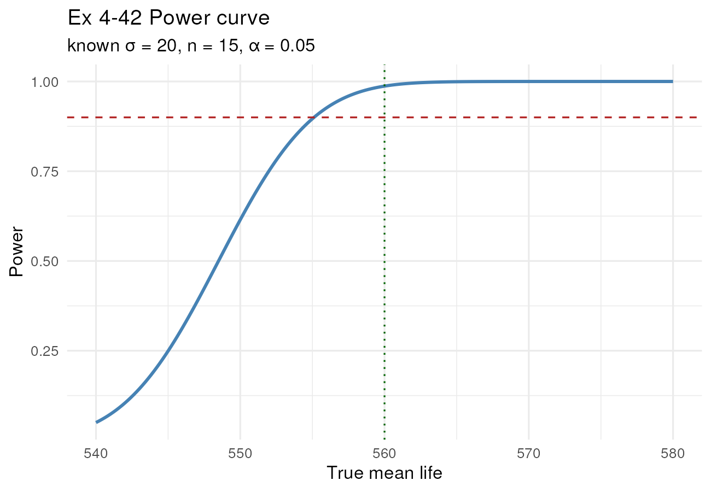
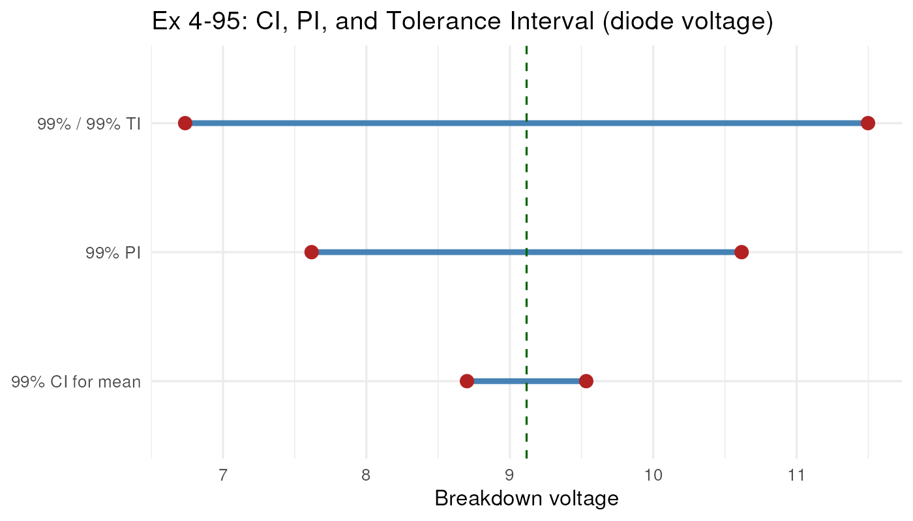

```{r setup, include=FALSE}
knitr::opts_chunk$set(
  echo       = TRUE,
  warning    = FALSE,
  message    = FALSE,
  fig.width  = 6.5,
  fig.height = 4.0,
  fig.align  = "center",
  out.width  = "82%",
  collapse   = TRUE,
  comment    = "#>",
  results    = "hold",
  tidy       = FALSE,
  fig.pos    = "H"
)
knitr::read_chunk("homework1.R")
```

```{r init, include=FALSE}
```

\newpage

# 報告概述 / Overview

這次作業總共 10 題，全部出自 Montgomery 教科書第 4 章 *Decision Making for a Single
Sample*。10 題依題型大致可以分成五群：

- **已知 $\sigma$ 的平均數推論**：4-42、4-44，用常態的 z 檢定。
- **未知 $\sigma$ 的平均數推論**：4-54、4-59、4-65，用 t 檢定，順便檢查資料是否近似常態。
- **單一母體標準差**：4-71，用 $\chi^2$ 檢定。
- **單一比例**：4-75、4-76、4-89，用 z 近似，最後一題加碼比較傳統 Wald CI 跟 Agresti-Coull 兩種寫法。
- **預測與容忍區間**：4-95，要把 PI 跟 TI 區分清楚。

每題的處理流程都跟教科書範本一致：先把資料 hard-code 進來、印描述統計、做必要的常態性檢查、跑檢定算 P-value，必要時補上 power、樣本數，再加幾張視覺化的圖。所有數值依 AGENTS.md
的慣例四捨五入到小數第四位（樣本數一律 `ceiling()`）。

整份報告的閱讀順序是：題目原文 $\rightarrow$ R 程式 $\rightarrow$ Console 輸出 $\rightarrow$
圖 $\rightarrow$ 最終答案。共用工具函式（如 `Pwr.z.test`、`Pwr.t.test.custom`、`find_min_n_t`、`Pwr.chisq.test`、`prop_wald_ci`、`agresti_coull_ci`、`prediction_interval_normal`）跟套件載入都統一放在腳本最前段，完整 R 原始碼在文末的「附錄 A」一次列出。

\newpage

# Exercise 4-42: Thermocouple Life

\begin{questionbox}
\textbf{4-42.} The life in hours of a thermocouple used in a furnace is known to be approximately normally distributed, with standard deviation $\sigma = 20$ hours. A random sample of 15 thermocouples resulted in the following data:

553, 552, 567, 579, 550, 541, 537, 553, 552, 546, 538, 553, 581, 539, 529.

\begin{enumerate}[label=(\alph*),topsep=2pt,itemsep=0pt]
\item Is there evidence to support the claim that mean life exceeds 540 hours? Use a fixed-level test with $\alpha = 0.05$.
\item What is the $P$-value for this test?
\item What is the $\beta$-value for this test if the true mean life is 560 hours?
\item What sample size would be required to ensure that $\beta$ does not exceed 0.10 if the true mean life is 560 hours?
\item Construct a 95\% one-sided lower CI on the mean life.
\item Use the CI found in part (e) to test the hypothesis.
\end{enumerate}
\end{questionbox}

```{r ex42}
```

```{r ex42-fig, echo=FALSE, fig.cap="Ex 4-42 Power curve（紅虛線是目標 power = 0.9，綠點線是 $\\mu_{true}=560$）"}

```

\begin{answerbox}
\begin{itemize}
\item \textbf{(a)(b)} 算出 $z_0 = 2.1947$、P-value $= 0.0141$，比 $\alpha = 0.05$ 小，所以 \textbf{REJECT $H_0$}；資料站得住腳，平均壽命確實超過 540 小時。
\item \textbf{(c)} 假設真實平均跑到 $\mu = 560$，$\beta \approx 0.0129$、power $\approx 0.9871$，這個 $n=15$ 已經很敏感了。
\item \textbf{(d)} 要把 $\beta$ 壓到 0.10 以下：$n = 8$ 時 power 只有 0.8817 還差一點，$n = 9$ 時 power 衝到 0.9123 過關，所以 $n = \mathbf{9}$。
\item \textbf{(e)} 95\% 一邊下界 CI：$[\,542.8393,\;\infty)$。
\item \textbf{(f)} 下界 542.8393 已經跑到 540 上面去了，0 假設值掉到 CI 之外，自然也是 \textbf{REJECT $H_0$}，跟 (a) 結論一致。
\end{itemize}
\end{answerbox}

\newpage

# Exercise 4-44: Sample Size for Estimating the Mean

\begin{questionbox}
\textbf{4-44.} Suppose that in Exercise 4-42 we wanted to be 95\% confident that the error in estimating the mean life is less than 5 hours. What sample size should we use?
\end{questionbox}

```{r ex44}
```

\begin{answerbox}
直接套已知 $\sigma$ 的 margin-of-error 公式：
\[
n \;=\; \left\lceil \left(\frac{z_{0.025}\,\sigma}{E}\right)^{\!2}\right\rceil
     \;=\; \left\lceil \left(\frac{1.96 \times 20}{5}\right)^{\!2}\right\rceil
     \;=\; \lceil 61.4633 \rceil \;=\; \mathbf{62}\,.
\]
\end{answerbox}

\newpage

# Exercise 4-54: Interior Temperature

\begin{questionbox}
\textbf{4-54.} An article in the \emph{ASCE Journal of Energy Engineering} (Vol. 125, 1999, pp. 59-75) describes a study of the thermal inertia properties of autoclaved aerated concrete used as a building material. Five samples of the material were tested in a structure, and the average interior temperature ($^\circ$C) reported was as follows:

23.01, 22.22, 22.04, 22.62, and 22.59.

\begin{enumerate}[label=(\alph*),topsep=2pt,itemsep=0pt]
\item Test the hypotheses $H_0: \mu = 22.5$ versus $H_1: \mu \neq 22.5$, using $\alpha = 0.05$. Use the $P$-value approach.
\item Check the assumption that interior temperature is normally distributed.
\item Find a 95\% CI on the mean interior temperature.
\item What sample size would be required to detect a true mean interior temperature as high as 22.75 if we wanted the power of the test to be at least 0.9? Use the sample standard deviation $s$ as an estimate of $\sigma$.
\end{enumerate}
\end{questionbox}

```{r ex54}
```

```{r ex54-figs, echo=FALSE, fig.show='hold', out.width="48%", fig.cap="Ex 4-54 常態性檢查：Q-Q plot 與直方圖（已標註 Shapiro-Wilk 結果與描述統計）"}
knitr::include_graphics(c("plots/ex4_54_qq.png", "plots/ex4_54_hist.png"))
```

\begin{answerbox}
\begin{itemize}
\item \textbf{(a)} $t_0 = -0.0236$、P-value $= 0.9823$，遠大於 $\alpha = 0.05$，\textbf{FAIL TO REJECT $H_0$}：沒有夠強的證據說 $\mu \ne 22.5$。
\item \textbf{(b)} Shapiro-Wilk $W = 0.9597$、$p = 0.8058$；Q-Q plot 上 5 個點落在斜線附近，常態假設可以接受。樣本數很小，不過度宣稱。
\item \textbf{(c)} 95\% CI for $\mu$：$(22.0262,\;22.9658)$，22.5 落在區間裡，跟 (a) 一致。
\item \textbf{(d)} 用 sample SD 當 $\sigma$ 估計，要 power $\ge 0.9$ 偵測 $\mu = 22.75$，$n = \mathbf{27}$（$n=26$ 時 power $= 0.8993$ 還差一點，$n=27$ 時 power $= 0.9106$ 過關）。
\end{itemize}
\end{answerbox}

\newpage

# Exercise 4-59: Diode Breakdown Voltage

\begin{questionbox}
\textbf{4-59.} In building electronic circuitry, the breakdown voltage of diodes is an important quality characteristic. The breakdown voltage of 12 diodes was recorded as follows:

9.099, 9.174, 9.327, 9.377, 8.471, 9.575, 9.514, 8.928, 8.800, 8.920, 9.913, and 8.306.

\begin{enumerate}[label=(\alph*),topsep=2pt,itemsep=0pt]
\item Check the normality assumption for the data.
\item Test the claim that the mean breakdown voltage is less than 9 volts with a significance level of 0.05.
\item Construct a 95\% one-sided upper confidence bound on the mean breakdown voltage.
\item Use the bound found in part (c) to test the hypothesis.
\item Suppose that the true breakdown voltage is 8.8 volts; it is important to detect this with a probability of at least 0.95. Using the sample standard deviation to estimate the population standard deviation and a significance level of 0.05, determine the necessary sample size.
\end{enumerate}
\end{questionbox}

```{r ex59}
```

```{r ex59-figs, echo=FALSE, fig.show='hold', out.width="48%", fig.cap="Ex 4-59 常態性檢查：Q-Q plot 與直方圖"}
knitr::include_graphics(c("plots/ex4_59_qq.png", "plots/ex4_59_hist.png"))
```

\begin{answerbox}
\begin{itemize}
\item \textbf{(a)} Shapiro-Wilk $W = 0.9842$、$p = 0.9953$；Q-Q plot 與直方圖看起來都接近常態，沒有明顯偏離。
\item \textbf{(b)} $t_0 = 0.8738$、P-value $= 0.7996$，\textbf{FAIL TO REJECT $H_0$}：沒有證據支持「平均崩潰電壓低於 9 V」這個說法。
\item \textbf{(c)} 95\% 一邊上界 CI：$(-\infty,\;9.3575\,]$。
\item \textbf{(d)} UCL $= 9.3575$ 比 9 大，9 還在 CI 裡 $\Rightarrow$ 不拒絕 $H_0$（跟 (b) 一致）。
\item \textbf{(e)} 用 sample SD 估 $\sigma$，要在 $\alpha = 0.05$ 下偵測 $\mu = 8.8$ 的機率達 0.95，$n = \mathbf{60}$（$n=59$ 時 power $= 0.9483$ 差一點，$n=60$ 時 power $= 0.9512$ 剛好過）。
\end{itemize}
\end{answerbox}

\newpage

# Exercise 4-65: Cloud Seeding Rainfall

\begin{questionbox}
\textbf{4-65.} Cloud seeding has been studied for many decades as a weather modification procedure (for an interesting study of this subject, see the article in \emph{Technometrics}, ``A Bayesian Analysis of a Multiplicative Treatment Effect in Weather Modification,'' Vol. 17, 1975, pp. 161-166). The rainfall in acre-feet from 20 clouds that were selected at random and seeded with silver nitrate follows:

18.0, 30.7, 19.8, 27.1, 22.3, 18.8, 31.8, 23.4, 21.2, 27.9, 31.9, 27.1, 25.0, 24.7, 26.9, 21.8, 29.2, 34.8, 26.7, and 31.6.

\begin{enumerate}[label=(\alph*),topsep=2pt,itemsep=0pt]
\item Can you support a claim that mean rainfall from seeded clouds exceeds 25 acre-feet? Use $\alpha = 0.01$. Find the $P$-value.
\item Check that rainfall is normally distributed.
\item Compute the power of the test if the true mean rainfall is 27 acre-feet.
\item What sample size would be required to detect a true mean rainfall of 27.5 acre-feet if we wanted the power of the test to be at least 0.9?
\item Explain how the question in part (a) could be answered by constructing a one-sided confidence bound on the mean diameter.
\end{enumerate}
\end{questionbox}

```{r ex65}
```

```{r ex65-figs, echo=FALSE, fig.show='hold', out.width="48%", fig.cap="Ex 4-65 常態性檢查：Q-Q plot 與直方圖"}
knitr::include_graphics(c("plots/ex4_65_qq.png", "plots/ex4_65_hist.png"))
```

\begin{answerbox}
\begin{itemize}
\item \textbf{(a)} $t_0 = 0.9674$、P-value $= 0.1728$，$\alpha = 0.01$ 下 \textbf{FAIL TO REJECT $H_0$}：證據還不夠強，沒辦法支持「平均雨量超過 25 acre-feet」。
\item \textbf{(b)} Shapiro-Wilk $W = 0.9702$、$p = 0.7601$，常態假設可以接受。
\item \textbf{(c)} 真實 $\mu = 27$ 時 power $\approx 0.2781$、$\beta \approx 0.7219$，這代表 $n = 20$ 對 2 acre-feet 的差距偵測力其實不高。
\item \textbf{(d)} 想偵測 $\mu = 27.5$、power $\ge 0.9$，$n = \mathbf{51}$（$n=50$ 時 power $= 0.8971$，$n=51$ 過關）。
\item \textbf{(e)} 因 (a) 用 $\alpha = 0.01$，配對的是 \textbf{99\%} 一邊下界 CI（脈絡上看是 mean rainfall）：$[\,23.3180,\;\infty)$。LCL 沒跑到 25 上面，跟 (a) 一樣 \textbf{不拒絕 $H_0$}；用一邊下界比較 25 跟 P-value 的結論完全一致。
\item \textit{補註：題目英文寫 "mean diameter" 跟前後文的雨量主題不符，疑似原書誤植。本題答案依雨量脈絡作答。}
\end{itemize}
\end{answerbox}

\newpage

# Exercise 4-71: Inference on $\sigma$ (Titanium Alloy)

\begin{questionbox}
\textbf{4-71.} The percentage of titanium in an alloy used in aerospace castings is measured in 51 randomly selected parts. The sample standard deviation is $s = 0.37$.

\begin{enumerate}[label=(\alph*),topsep=2pt,itemsep=0pt]
\item Test the hypothesis $H_0: \sigma = 0.35$ versus $H_1: \sigma \ne 0.35$ using $\alpha = 0.05$. State any necessary assumptions about the underlying distribution of the data.
\item Find the $P$-value for this test.
\item Construct a 95\% two-sided CI for $\sigma$.
\item Use the CI in part (c) to test the hypothesis.
\end{enumerate}
\end{questionbox}

```{r ex71}
```

\begin{answerbox}
\begin{itemize}
\item \textbf{前提}：母體要近似常態，這個 $\chi^2$ 推論才有效。
\item \textbf{(a)(b)} $\chi_0^2 = (n-1) s^2 / \sigma_0^2 = 55.8776$、df $= 50$，雙尾 P-value $= 0.5272$ $\Rightarrow$ \textbf{FAIL TO REJECT $H_0$}。
\item \textbf{(c)} 先算 $\sigma^2$ 的 95\% CI：$(0.0958,\;0.2115)$，開根號得 $\sigma$ 的 95\% CI：$(0.3096,\;0.4599)$。
\item \textbf{(d)} $\sigma_0 = 0.35$ 落在 CI $(0.3096, 0.4599)$ 內 $\Rightarrow$ 不拒絕 $H_0$，跟 (a) 一致。
\end{itemize}
\end{answerbox}

\newpage

# Exercise 4-75: Van Rollover Proportion

\begin{questionbox}
\textbf{4-75.} Large passenger vans are thought to have a high propensity of rollover accidents when fully loaded. Thirty accidents of these vans were examined, and 11 vans had rolled over.

\begin{enumerate}[label=(\alph*),topsep=2pt,itemsep=0pt]
\item Test the claim that the proportion of rollovers exceeds 0.25 with $\alpha = 0.10$.
\item Suppose that the true $p = 0.35$ and $\alpha = 0.10$. What is the $\beta$-error for this test?
\item Suppose that the true $p = 0.35$ and $\alpha = 0.10$. How large a sample would be required if we want $\beta = 0.10$?
\item Find a 90\% traditional lower confidence bound on the rollover rate of these vans.
\item Use the confidence bound found in part (d) to test the hypothesis.
\item How large a sample would be required to be at least 95\% confident that the error on $p$ is less than 0.02? Use an initial estimate of $p$ from this problem.
\end{enumerate}
\end{questionbox}

```{r ex75}
```

\enlargethispage{8\baselineskip}

\begin{answerbox}
\begin{itemize}
\item \textbf{(a)} $z_0 = 1.4757$、P-value $= 0.0700$，$\alpha = 0.10$ 下 \textbf{REJECT $H_0$}；「翻覆比例超過 0.25」這個論點站得住腳。
\item \textbf{(b)} 真實 $p = 0.35$ 時 $\beta \approx 0.5060$（蠻高的，因為效應量只有 0.10、$n = 30$ 偏小）。
\item \textbf{(c)} 想把 $\beta$ 壓到 0.10，所需 $n = \mathbf{136}$。
\item \textbf{(d)} 90\% 傳統一邊下界 CI：$[\,0.2539,\;1\,]$。
\item \textbf{(e)} LCB $= 0.2539$ 已經超過 $p_0 = 0.25$，0 假設值掉到 CI 之外 $\Rightarrow$ \textbf{REJECT $H_0$}，跟 (a) 同一個結論。
\item \textbf{(f)} 用 $\hat p = 11/30$、要 95\% 信心、誤差 $< 0.02$，所需 $n = \mathbf{2231}$。
\end{itemize}
\end{answerbox}

\newpage

# Exercise 4-76: Helmet Damage Proportion

\begin{questionbox}
\textbf{4-76.} A random sample of 50 suspension helmets used by motorcycle riders and automobile race-car drivers was subjected to an impact test, and on 18 of these helmets some damage was observed.

\begin{enumerate}[label=(\alph*),topsep=2pt,itemsep=0pt]
\item Test the hypotheses $H_0: p = 0.3$ versus $H_1: p \ne 0.3$ with $\alpha = 0.05$.
\item Find the $P$-value for this test.
\item Find a 95\% two-sided traditional CI on the true proportion of helmets of this type that would show damage from this test. Explain how this confidence interval can be used to test the hypothesis in part (a).
\item Using the point estimate of $p$ obtained from the preliminary sample of 50 helmets, how many helmets must be tested to be 95\% confident that the error in estimating the true value of $p$ is less than 0.02?
\item How large must the sample be if we wish to be at least 95\% confident that the error in estimating $p$ is less than 0.02, regardless of the true value of $p$?
\end{enumerate}
\end{questionbox}

```{r ex76}
```

\begin{answerbox}
\begin{itemize}
\item \textbf{(a)(b)} $z_0 = 0.9258$、P-value $= 0.3545$，\textbf{FAIL TO REJECT $H_0$}：沒有夠強的證據說 $p \ne 0.3$。
\item \textbf{(c)} 95\% 雙尾傳統 (Wald) CI：$(0.2270,\;0.4930)$；$p_0 = 0.30$ 落在區間裡 $\Rightarrow$ 不拒絕 $H_0$，跟 (a) 結論一致。這是 CI 跟雙尾檢定的等價性。
\item \textbf{(d)} 用 $\hat p = 18/50$ 估算誤差 $< 0.02$，$n = \mathbf{2213}$。
\item \textbf{(e)} 不知道 $p$ 時用最保守的 $p = 0.5$，$n = \mathbf{2401}$。
\end{itemize}
\end{answerbox}

\newpage

# Exercise 4-89: Agresti-Coull CI

\begin{questionbox}
\textbf{4-89.} Consider the helmet data given in Exercise 4-76. Calculate the 95\% Agresti-Coull two-sided CI from equation 4-76 and compare it to the traditional CI in the original exercise.
\end{questionbox}

```{r ex89}
```

\begin{answerbox}
\begin{itemize}
\item Agresti-Coull 的核心改動是把 $(x, n)$ 換成 $(x + z^2/2,\, n + z^2)$ 後再套 Wald 形式。這裡 $\tilde n = 53.8415$、$\tilde p = 0.3700$（明顯偏向 0.5 一點點）。
\item Agresti-Coull 95\% CI：$(0.2410,\;0.4989)$，寬度 0.2579。
\item 4-76 的傳統 Wald 95\% CI：$(0.2270,\;0.4930)$，寬度 0.2661。
\item 兩條 CI 看起來差距很小，但 Agresti-Coull 區間寬度略小、且中心略偏向 0.5；在 $n$ 不大或 $\hat p$ 接近 0/1 時，它的實際涵蓋率比 Wald 更接近名目水準（這也是 Brown, Cai \& DasGupta 推薦它的理由）。
\end{itemize}
\end{answerbox}

\newpage

# Exercise 4-95: Prediction \& Tolerance Interval

\begin{questionbox}
\textbf{4-95.} Consider the breakdown voltage of diodes described in Exercise 4-59.

\begin{enumerate}[label=(\alph*),topsep=2pt,itemsep=0pt]
\item Construct a 99\% PI for the breakdown voltage of a single diode.
\item Find a tolerance interval for the breakdown voltage that includes 99\% of the diodes with 99\% confidence.
\end{enumerate}
\end{questionbox}

```{r ex95}
```

```{r ex95-fig, echo=FALSE, out.width="68%", fig.height=2.8, fig.cap="Ex 4-95 三種區間並列：99\\% CI for $\\mu$、99\\% PI、99\\%/99\\% TI"}

```

\enlargethispage{4\baselineskip}

\begin{answerbox}
\begin{itemize}
\item \textbf{(a)} 99\% 預測區間 (PI) for 一筆未來觀測：$(7.6177,\;10.6163)$。
\item \textbf{(b)} 99\% / 99\% 常態容忍區間 (TI)：$(6.7362,\;11.4978)$。
\item 三種區間寬度順序剛好印證理論：CI for $\mu$ $<$ PI $<$ TI，因為覆蓋對象一個比一個廣（平均數 $\to$ 下一筆觀測 $\to$ 母體 99\%）。
\end{itemize}
\end{answerbox}

\newpage

# 結語 / Closing Notes

做完這份作業，有幾個容易踩到雷、但這次都有刻意守住的地方順便整理一下：

- **資料原樣保留**：題目給的數字一個都沒改，全部照原文 hard-code。
- **單尾 / 雙尾要看清楚**：4-42、4-59、4-65、4-75 是單尾，4-54、4-71、4-76、4-89 是雙尾，方向搞錯就直接答錯。
- **$\sigma$ 已知 vs 未知**：4-42、4-44 用 z；4-54、4-59、4-65 用 t（樣本數估算時用 sample SD 當 $\sigma$ 的估計，題目有特別交代）。
- **常態假設**：4-71 的 $\chi^2$ 推論明確寫了「假設母體近似常態」；4-54、4-59、4-65 的 t 檢定都附 Shapiro-Wilk 與 Q-Q plot 一起看，避免單看 Shapiro-Wilk 的低 power 結果做過度判斷。
- **樣本數**：一律用 `ceiling()`，並且額外印 $n-1$ 與 $n$ 兩點的 power 來驗證。
- **PI 跟 TI 不能混**：PI 是「下一筆觀測」的範圍，TI 是「母體覆蓋率」的範圍，4-95 三條區間並列就看得很清楚。
- **Agresti-Coull**：只用在 4-89 一題，並且明確跟傳統 Wald CI 並列比較。

\begin{flushleft}
R 4.4.1 跑完所有題目，繪圖用 \texttt{ggplot2}；
套件交叉驗證用 \texttt{BSDA::z.test}、\texttt{stats::t.test}、\texttt{stats::prop.test}、\texttt{tolerance::normtol.int}。
\end{flushleft}

\newpage

# 附錄 A：完整 R 原始碼 (`homework1.R`)

\VerbatimInput[fontsize=\footnotesize,breaklines=true,breakanywhere=true,numbers=left,numbersep=4pt,frame=leftline,framesep=4pt]{homework1.R}
