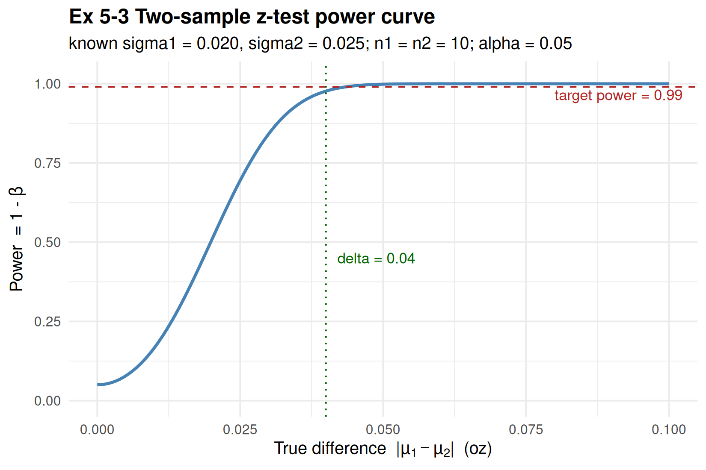
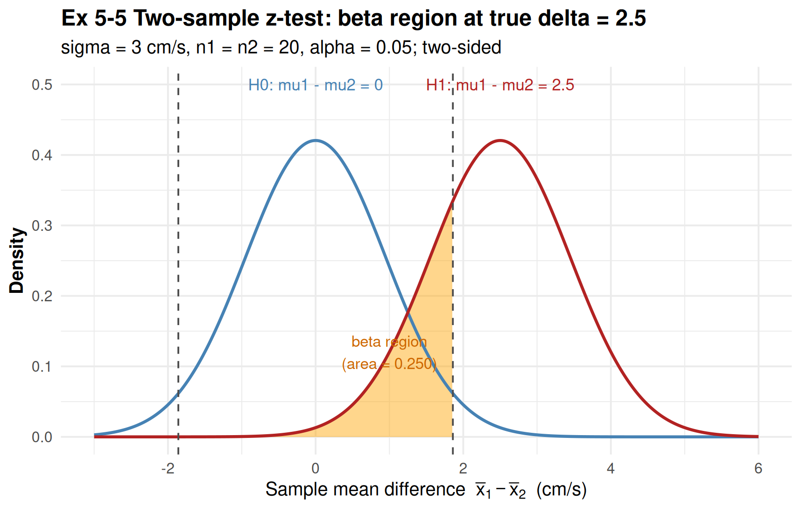
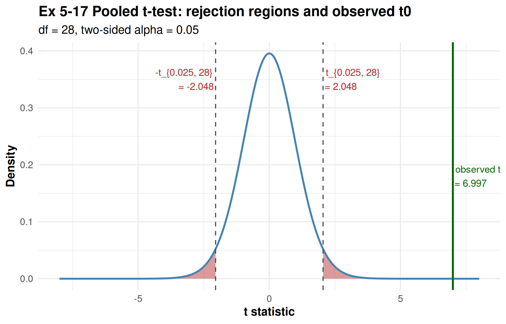
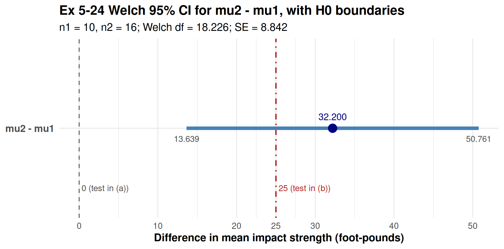
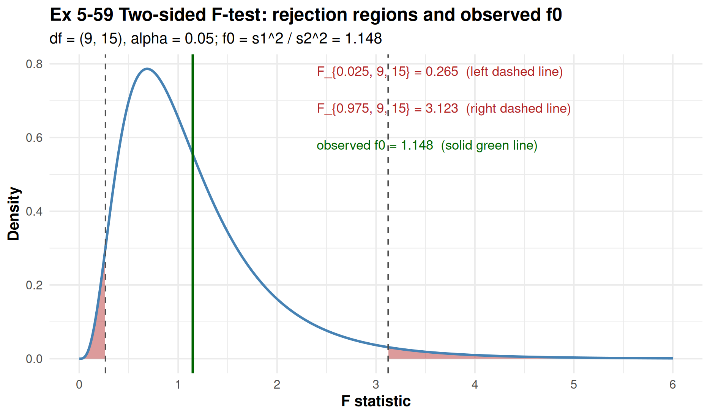
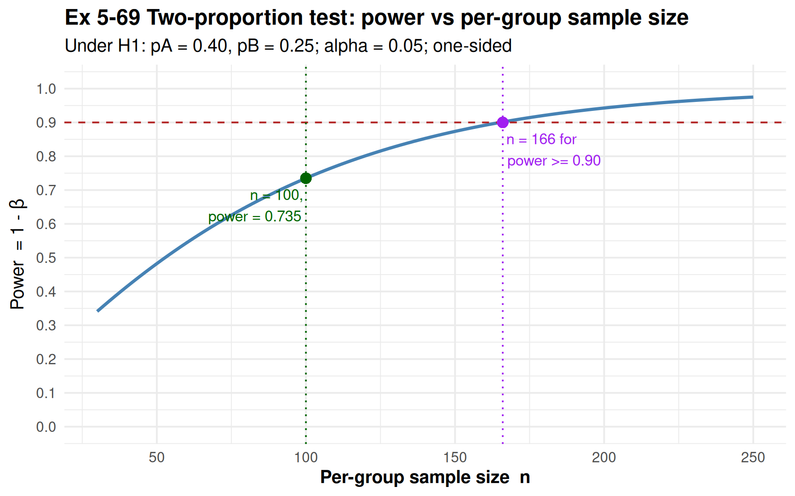
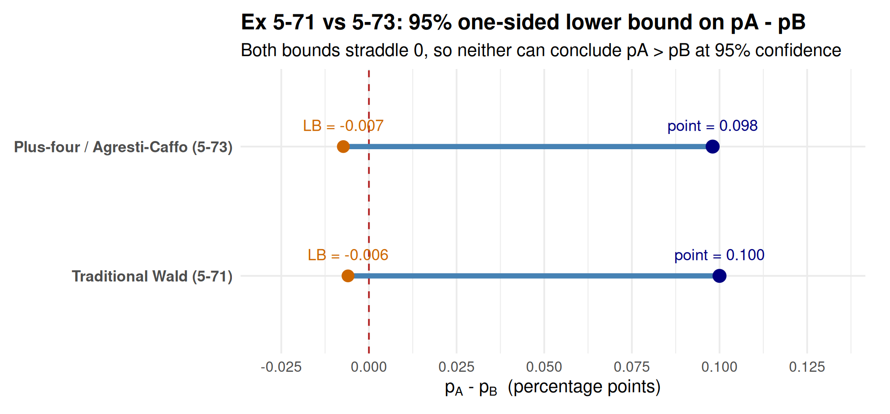

```{r setup, include=FALSE}
knitr::opts_chunk$set(
  echo       = TRUE,
  warning    = FALSE,
  message    = FALSE,
  fig.width  = 6.5,
  fig.height = 4.0,
  fig.align  = "center",
  out.width  = "82%",
  collapse   = TRUE,
  comment    = "#>",
  results    = "hold",
  tidy       = FALSE,
  fig.pos    = "H"
)
knitr::read_chunk("homework_assignments_2.R")
```

```{r init, include=FALSE}
```

\newpage

# 報告概述 / Overview

這次作業總共 10 題，題目全部出自 Montgomery 教科書第 5 章 *Decision Making for Two
Samples*。10 題依題型大致可以分成五群：

- **已知變異數的兩平均數推論**：5-3、5-5、5-9，使用兩樣本 z 檢定 / 信賴區間 /
  樣本數公式。
- **未知變異數的兩平均數推論**：5-17 用 pooled t（變異數相等）；5-24 用 Welch t
  （變異數不等）。
- **配對資料**：5-41，配對 t 檢定 + 差值常態性檢查。
- **兩變異數比較**：5-59，F 檢定。
- **兩比例推論**：5-69（檢定 + power + 樣本數）、5-71（傳統 Wald 下界）、
  5-73（plus-four / Agresti-Caffo 新 CI）。

每題的處理流程都跟教科書範本一致：先把資料 hard-code 進來、印描述統計、做必要
的假設檢查、跑檢定算 P-value，必要時補上 power、樣本數、信賴區間或下界，最後
給出實務脈絡的解釋。所有數值依本次作業規範**四捨五入到第三位小數**，樣本數
一律 `ceiling()`。共用工具函式（`Pwr.z.test`、`SplSz.z.test`、`SplSz.z.CI`、
`Pwr.t.test`、`TwoPropStats`、`Pwr.prop2.test`、`SplSz.prop2.test`、`get_stats`、
`save_normality_plots`）跟套件載入都統一放在 `homework_assignments_2.R` 的最前段。
本 PDF 只呈現每題的統計計算程式碼與 console 結果，繪圖程式碼放在獨立的
`_plot` chunks 裡執行但不嵌入 PDF，避免畫面被 `ggplot` 樣板程式塞滿。

> 助教校正：5-69(b)(c) 中提到的 $p_A = 0.4$、$p_B = 0.25$ 是 **$H_1$ 下的真實
> $p$**（為了算 power / 樣本數而設定），跟資料給的點估計 $\hat p_A = 35/100$、
> $\hat p_B = 25/100$ 不同，下方的解題會明確區分。

\newpage

# Exercise 5-3: Bottle Filling Machines

\begin{questionbox}
\textbf{5-3.} Two machines are used for filling plastic bottles with a net volume of 16.0 ounces. The fill volume can be assumed normal, with standard deviation $\sigma_1 = 0.020$ and $\sigma_2 = 0.025$ ounces. A member of the quality engineering staff suspects that both machines fill to the same mean net volume, whether or not this volume is 16.0 ounces. A random sample of 10 bottles is taken from the output of each machine.

\begin{enumerate}[label=(\alph*),topsep=2pt,itemsep=0pt]
\item Do you think the engineer is correct? Use the $P$-value approach.
\item If $\alpha = 0.05$, what is the power of the test in part (a) for a true difference in means of 0.04?
\item Find a 95\% CI on the difference in means. Provide a practical interpretation of this interval.
\item Assuming equal sample sizes, what sample size should be used to ensure that $\beta = 0.01$ if the true difference in means is 0.04? Assume that $\alpha = 0.05$.
\end{enumerate}
\end{questionbox}

```{r ex5_03}
```

```{r ex5_03-fig, echo=FALSE, out.width="88%", fig.cap="Ex 5-3 Power curve：X 軸是真實平均差 $|\\mu_1 - \\mu_2|$（oz），Y 軸是 power；紅虛線標目標 power = 0.99，綠點線標 $\\delta = 0.04$。"}

```

\begin{answerbox}
\begin{itemize}
\item \textbf{(a)} $\bar{x}_1 - \bar{x}_2 = 0.010$、$SE_0 = 0.010$、$z_0 = 0.988$、$P\text{-value} = 0.323$。$P > 0.05$，\textbf{FAIL TO REJECT $H_0$}：兩台機台的平均填裝量目前沒有顯著差異。
\item \textbf{(b)} 真實 $|\mu_1 - \mu_2| = 0.04$ 時，power $= 0.977$、$\beta = 0.023$。
\item \textbf{(c)} 95\% CI for $\mu_1 - \mu_2 = (-0.010,\;0.030)$。0 在 CI 裡，與 (a) 一致。
\item \textbf{(d)} 要 $\beta = 0.01$、$\alpha = 0.05$、$\delta = 0.04$，$n = \lceil(z_{0.025} + z_{0.01})^2(\sigma_1^2+\sigma_2^2)/\delta^2\rceil = \mathbf{12}$ 每組（$n=11$ 時 power $= 0.986$，$n=12$ 時 power $= 0.991$ 過關）。
\end{itemize}
\end{answerbox}

\newpage

# Exercise 5-5: Solid-Fuel Propellant Burning Rates

\begin{questionbox}
\textbf{5-5.} The burning rates of two different solid-fuel propellants used in aircrew escape systems are being studied. It is known that both propellants have approximately the same standard deviation of burning rate; that is, $\sigma_1 = \sigma_2 = 3$ cm/s. Two random samples of $n_1 = 20$ and $n_2 = 20$ specimens are tested; the sample mean burning rates are $\bar{x}_1 = 18.02$ cm/s and $\bar{x}_2 = 24.37$ cm/s.

\begin{enumerate}[label=(\alph*),topsep=2pt,itemsep=0pt]
\item Test the hypothesis that both propellants have the same mean burning rate. Use a fixed-level test with $\alpha = 0.05$.
\item What is the $P$-value of the test in part (a)?
\item What is the $\beta$-error of the test in part (a) if the true difference in mean burning rate is 2.5 cm/s?
\item Construct a 95\% CI on the difference in means $\mu_1 - \mu_2$. What is the practical meaning of this interval?
\end{enumerate}
\end{questionbox}

```{r ex5_05}
```

```{r ex5_05-fig, echo=FALSE, out.width="88%", fig.cap="Ex 5-5 在真實 $\\delta = 2.5$ 下的 $\\beta$ 區域：藍色為 $H_0$ 抽樣分配、紅色為 $H_1$ 抽樣分配，灰色虛線是雙尾 $\\alpha = 0.05$ 的臨界值。橘色區域就是 $\\beta = 0.250$。"}

```

\begin{answerbox}
\begin{itemize}
\item \textbf{(a)(b)} $SE_0 = 0.949$、$z_0 = -6.693$、$|z_0| \gg z_{0.025} = 1.960$，雙尾 $P\text{-value} \approx 0$（印為 $0.000$）。$P < 0.05$，\textbf{REJECT $H_0$}：兩種推進劑的平均燃燒速率顯著不同。
\item \textbf{(c)} 真實 $\delta = 2.5$ 時，power $= 0.750$、\textbf{$\beta = 0.250$}（雙尾、$\alpha = 0.05$）。
\item \textbf{(d)} 95\% CI for $\mu_1 - \mu_2$：$(-8.209,\;-4.491)$。整個區間落在 0 左邊，印證推進劑 2 平均燃燒速率明顯高於推進劑 1，差距約 4.5 \textasciitilde{} 8.2 cm/s。
\end{itemize}
\end{answerbox}

\newpage

# Exercise 5-9: Sample Size for the Difference in Means

\begin{questionbox}
\textbf{5-9.} Consider the situation described in Exercise 5-5. What sample size would be required in each population if we wanted the error in estimating the difference in mean burning rates to be less than 4 cm/s with 99\% confidence?
\end{questionbox}

```{r ex5_09}
```

\begin{answerbox}
直接套兩樣本 z 區間的等樣本數公式：
\[
n \;=\; \left\lceil \frac{z_{0.005}^2\,(\sigma_1^2 + \sigma_2^2)}{E^2}\right\rceil
   \;=\; \left\lceil \frac{2.576^2 \cdot (9+9)}{16}\right\rceil
   \;=\; \lceil 7.464\rceil \;=\; \mathbf{8}\ \text{每組}.
\]
\end{answerbox}

\newpage

# Exercise 5-17: Single vs Dual Spindle Saw

\begin{questionbox}
\textbf{5-17.} An article in \emph{Electronic Components and Technology Conference} (Vol. 52, 2001, pp. 1167--1171) describes a study comparing single versus dual spindle saw processes for copper metallized wafers. A total of 15 devices of each type were measured for the width of the backside chipouts, $\bar{x}_{single} = 66.385$, $s_{single} = 7.895$ and $\bar{x}_{double} = 45.278$, $s_{double} = 8.612$.

\begin{enumerate}[label=(\alph*),topsep=2pt,itemsep=0pt]
\item Do the sample data support the claim that both processes have the same chip outputs? Assume that both populations are normally distributed and have the same variance. Answer this question by finding and interpreting the $P$-value for the test.
\item Construct a 95\% two-sided confidence interval on the mean difference in spindle saw process. Compare this interval to the results in part (a).
\item If the $\beta$-error of the test when the true difference in chip outputs is 15 should not exceed 0.1 when $\alpha = 0.05$, what sample sizes must be used?
\end{enumerate}
\end{questionbox}

```{r ex5_17}
```

```{r ex5_17-fig, echo=FALSE, out.width="88%", fig.cap="Ex 5-17 pooled t 拒絕區與觀察到的 $t_0$：X 軸是 t 統計量、Y 軸是密度；灰色虛線是 $\\pm t_{0.025,28}$，淺紅色就是雙尾拒絕區，深綠色實線是觀察到的 $t_0 = 6.997$（完全跑到右尾外，所以 P-value 極小）。"}

```

\begin{answerbox}
\begin{itemize}
\item \textbf{(a)} $s_p = 8.261$、$SE = 3.017$、$t_0 = 6.997$、$df = 28$；雙尾 $P\text{-value} \approx 1.31 \times 10^{-7}$，遠小於 0.05 $\Rightarrow$ \textbf{REJECT $H_0$}：single 跟 double 製程的 backside chipout 平均不同。
\item \textbf{(b)} 95\% CI for $\mu_{single} - \mu_{double} = (14.928,\;27.286)$，整段大於 0，跟 (a) 一致；single 製程的 backside chipout 平均比 double 多出大約 14.9 \textasciitilde{} 27.3 個單位。
\item \textbf{(c)} 要 $\beta \le 0.1$、$\delta = 15$、$\alpha = 0.05$，以 $s_p$ 當 $\sigma$ 估計，$n = \mathbf{8}$ 每組（$n=7$ 時 power $= 0.876$，$n=8$ 時 power $= 0.921$）。
\end{itemize}
\end{answerbox}

\newpage

# Exercise 5-24: Plastic Gear Suppliers

\begin{questionbox}
\textbf{5-24.} Two suppliers manufacture a plastic gear used in a laser printer. The impact strength of these gears measured in foot-pounds is an important characteristic. A random sample of 10 gears from supplier 1 results in $\bar{x}_1 = 289.30$ and $s_1 = 22.5$, and another random sample of 16 gears from the second supplier results in $\bar{x}_2 = 321.50$ and $s_2 = 21$.

\begin{enumerate}[label=(\alph*),topsep=2pt,itemsep=0pt]
\item Is there evidence to support the claim that supplier 2 provides gears with higher mean impact strength? Use the $P$-value approach, and assume that both populations are normally distributed but the variances are not equal.
\item Do the data support the claim that the mean impact strength of gears from supplier 2 is at least 25 foot-pounds higher than that of supplier 1? Make the same assumptions as in part (a).
\item Construct an appropriate 95\% CI on the difference in mean impact strength. Use this interval to answer the question posed in part (b).
\end{enumerate}
\end{questionbox}

```{r ex5_24}
```

```{r ex5_24-fig, echo=FALSE, out.width="92%", fig.cap="Ex 5-24 Welch 95\\% CI for $\\mu_2 - \\mu_1$（藍粗線段），點估計 32.200 在中央。灰色虛線是 (a) 的 $\\Delta_0 = 0$，紅色點劃線是 (b) 的 $\\Delta_0 = 25$。0 落在 CI 之外（拒絕 (a)）、25 落在 CI 之內（不拒絕 (b)）。"}

```

\begin{answerbox}
\begin{itemize}
\item \textbf{(a)} Welch $SE = 8.842$、$df = 18.226$、$t_0 = 3.642$、$P\text{-value} = 0.001 < 0.05$ $\Rightarrow$ \textbf{REJECT $H_0$}：supplier 2 的平均衝擊強度明顯較高。
\item \textbf{(b)} 邊界 $\Delta_0 = 25$，$t_0 = (32.200 - 25)/8.842 = 0.814$、$P\text{-value} = 0.213 > 0.05$ $\Rightarrow$ \textbf{FAIL TO REJECT $H_0$}：資料還不夠強到能宣稱「至少高 25 foot-pounds」。
\item \textbf{(c)} 95\% CI for $\mu_2 - \mu_1 = (13.639,\;50.761)$；25 在 CI 內，跟 (b) 結論一致。實務上 supplier 2 平均比 supplier 1 高 14 \textasciitilde{} 51 foot-pounds 都有可能。
\end{itemize}
\end{answerbox}

\newpage

# Exercise 5-41: Paired Coding Times

\begin{questionbox}
\textbf{5-41.} A computer scientist is investigating the usefulness of two different design languages in improving programming tasks. Twelve expert programmers, familiar with both languages, are asked to code a standard function in both languages, and the time in minutes is recorded.

\begin{enumerate}[label=(\alph*),topsep=2pt,itemsep=0pt]
\item Find a 95\% CI on the difference in mean coding times. Is there any indication that one design language is preferable?
\item Is it reasonable to assume that the difference in coding time is normally distributed? Show evidence to support your answer.
\end{enumerate}
\end{questionbox}

```{r ex5_41}
```

```{r ex5_41-figs, echo=FALSE, fig.show='hold', out.width="49%", fig.cap="Ex 5-41 配對差值的常態性檢查。左：Normal Q-Q plot（Y 軸 = 樣本分位數，單位分鐘），12 點貼合紅色參考線。右：直方圖與套疊常態曲線（X 軸 = Coding.diff，單位分鐘），底部 rug 標出 12 個觀測。"}
knitr::include_graphics(c("figures/5-41_diff_qq.png", "figures/5-41_diff_hist.png"))
```

\begin{answerbox}
\begin{itemize}
\item \textbf{方向約定}：$D_i = \text{Lang1}_i - \text{Lang2}_i$，$\bar D > 0$ 表示語言 1 比語言 2 多用時間。
\item \textbf{(a)} $\bar D = 0.667$、$s_D = 2.964$、$SE_D = 0.856$、$t_{0.025,11} = 2.201$；95\% CI $= (-1.217,\;2.550)$。0 落在 CI 內 $\Rightarrow$ 沒有夠強的證據說某種語言比較快。
\item \textbf{(b)} Shapiro-Wilk $W = 0.962$、$p = 0.807$；Q-Q plot 上 12 個點都在參考帶內，差值的常態假設可以接受，配對 t 推論是穩當的。
\end{itemize}
\end{answerbox}

\newpage

# Exercise 5-59: F-Test for Equal Variances (Gear Data)

\begin{questionbox}
\textbf{5-59.} Consider the gear impact strength data in Exercise 5-24. Is there sufficient evidence to conclude that the variance of impact strength is different for the two suppliers? Use $\alpha = 0.05$.
\end{questionbox}

```{r ex5_59}
```

```{r ex5_59-fig, echo=FALSE, out.width="92%", fig.cap="Ex 5-59 F(9,15) 分布、雙尾 $\\alpha = 0.05$ 拒絕區（淺紅色）、觀察到的 $f_0 = 1.148$（綠色實線）。$f_0$ 完全落在兩條虛線之間的接受區裡，所以不拒絕『兩變異數相等』。"}

```

\begin{answerbox}
\begin{itemize}
\item \textbf{(a)} $f_0 = s_1^2 / s_2^2 = 22.5^2 / 21^2 = 1.148$、$df = (9, 15)$；雙尾 $P\text{-value} = 0.781$，臨界值 $F_{0.025,9,15} = 0.265$、$F_{0.975,9,15} = 3.123$，$f_0$ 落在拒絕區外 $\Rightarrow$ \textbf{FAIL TO REJECT $H_0$}。
\item \textbf{(b)} 95\% CI for $\sigma_1^2/\sigma_2^2 = (0.368,\;4.327)$，1 在 CI 裡，跟 P-value 同一個結論。
\item \textbf{解讀}：兩 supplier 的衝擊強度變異數沒有顯著差異，這也支持了 5-24 用 Welch t（雖然不需要相等變異數）的選擇是穩妥的。
\end{itemize}
\end{answerbox}

\newpage

# Exercise 5-69: Rollover Rates (Two Proportions)

\begin{questionbox}
\textbf{5-69.} The rollover rate of sport utility vehicles is a transportation safety issue. Safety advocates claim that manufacturer A's vehicle has a higher rollover rate than that of manufacturer B. One hundred crashes for each of these vehicles were examined. The rollover rates were $\hat p_A = 0.35$ and $\hat p_B = 0.25$.

\begin{enumerate}[label=(\alph*),topsep=2pt,itemsep=0pt]
\item Does manufacturer A's vehicle have a higher rollover rate than manufacturer B's? Use the $P$-value approach.
\item What is the power of this test, assuming $\alpha = 0.05$?
\item Assume that the rollover rate of manufacturer A's vehicle is 0.15 higher than B's. Is the sample size sufficient for detecting this difference with probability level at least 0.90, if $\alpha = 0.05$?
\end{enumerate}
\textit{助教校正：(b)(c) 內的 $p_A = 0.4$、$p_B = 0.25$ 是 $H_1$ 下的真實 $p$，跟資料的 $\hat p_A$、$\hat p_B$ 是不同概念，不是改題目。}
\end{questionbox}

```{r ex5_69}
```

```{r ex5_69-fig, echo=FALSE, out.width="90%", fig.cap="Ex 5-69 在 $H_1: p_A = 0.40, p_B = 0.25$ 下，power 對每組樣本數 $n$ 的曲線。綠點 $n = 100$ 對應 power $= 0.735$、紫點是達到 power $\\ge 0.90$ 的 $n = 166$；紅虛線是目標 power。"}

```

\begin{answerbox}
\begin{itemize}
\item \textbf{(a)} pooled $\bar p = 0.300$、$SE_0 = 0.065$、$z_0 = 1.543$；單尾 $P\text{-value} = 0.061 > 0.05$ $\Rightarrow$ \textbf{FAIL TO REJECT $H_0$}：在 $\alpha = 0.05$ 下還不夠拒絕「A、B 翻覆率相同」。
\item \textbf{(b)} 在 $H_1$ 下 $p_A = 0.4$、$p_B = 0.25$、$n = (100, 100)$、$\alpha = 0.05$，power $= 0.735$、$\beta = 0.265$。
\item \textbf{(c)} 需 power $\ge 0.90$，由 $n = \lceil[z_{0.05}\sqrt{2\bar p \bar q} + z_{0.10}\sqrt{p_A q_A + p_B q_B}]^2 / (p_A - p_B)^2\rceil = \mathbf{166}$ 每組。當前 $n = 100$ 不夠，power 只有 0.735。
\end{itemize}
\end{answerbox}

\newpage

# Exercise 5-71: 95\% Lower Bound on $p_A - p_B$

\begin{questionbox}
\textbf{5-71.} Construct a 95\% lower bound on the difference in the two rollover rates for Exercise 5-69. Provide a practical interpretation of this interval.
\end{questionbox}

```{r ex5_71}
```

\begin{answerbox}
\begin{itemize}
\item 用傳統 Wald 形式：$\widehat{SE} = \sqrt{\hat p_A \hat q_A / n_A + \hat p_B \hat q_B / n_B} = 0.064$。
\item $LB = (\hat p_A - \hat p_B) - z_{0.05} \widehat{SE} = 0.100 - 1.645 \cdot 0.064 = \mathbf{-0.006}$；95\% one-sided lower bound 為 $[-0.006,\;1]$。
\item \textbf{解讀}：下界微微落在 0 以下，跟 5-69(a) 的 $P\text{-value} = 0.061$ 完全一致，在 95\% 信心下沒辦法斷言 $p_A > p_B$。換成百分點來看，這個下界相當於「A 比 B 最多高出 100\%、最少甚至低 0.6 個百分點」。
\end{itemize}
\end{answerbox}

\newpage

# Exercise 5-73: New CI (Plus-Four / Agresti-Caffo)

\begin{questionbox}
\textbf{5-73.} Rework Exercise 5-71 using the new CI. Compare this interval to the traditional one.
\end{questionbox}

```{r ex5_73}
```

```{r ex5_71-73-fig, echo=FALSE, out.width="95%", fig.cap="Ex 5-71 與 5-73 兩種 95\\% 單邊下界並列。橘點是下界、深藍點是點估計，紅虛線在 0。兩種方法的下界都落在 0 左側，所以都無法在 95\\% 信心下斷言 $p_A > p_B$。"}

```

\begin{answerbox}
\begin{itemize}
\item \textbf{方法}：$\tilde n = n + 2 = (102, 102)$、$\tilde x = x + 1 = (36, 26)$；$\tilde p = (0.353, 0.255)$、$\widetilde{SE} = 0.064$。
\item $LB_{\text{new}} = (\tilde p_A - \tilde p_B) - z_{0.05} \widetilde{SE} = 0.098 - 1.645 \cdot 0.064 = \mathbf{-0.007}$。
\item \textbf{比較}：傳統 $LB = -0.006$、new $LB = -0.007$，相差 $-0.001$。plus-four 把 $(x, n)$ 換成 $(x+1, n+2)$ 後點估計更靠近 0.5、$\widetilde{SE}$ 略大，所以下界比傳統 Wald 稍微保守一點點。
\item \textbf{結論}：兩種方法都跨過 0，定性結論一致：在 95\% 信心下沒辦法斷言 $p_A > p_B$。Plus-four 的價值體現在 $n$ 不大或 $\hat p$ 接近 0/1 時的實際涵蓋率，本題差距其實非常小。
\end{itemize}
\end{answerbox}

\newpage

# 結語 / Closing Notes

整份作業跑完後，幾個容易踩到、但這次都有刻意守住的細節整理一下：

- **資料原樣保留**：每題的 $\sigma$、$n$、$\bar x$、$s$、$x$ 都照題目原文 hard-code，
  沒有臨時改數字。
- **單尾 / 雙尾要分清楚**：5-3、5-5、5-17、5-41、5-59、5-73 是雙尾或 CI 形式；
  5-24、5-69、5-71 都是單尾。方向搞錯結論會反過來。
- **已知 $\sigma$ vs 未知 $\sigma$**：5-3、5-5、5-9 用 z（題目給 $\sigma$）；
  5-17、5-24、5-41 都用 t（資料給的是 $s$）。
- **變異數相等 vs 不等**：5-17 題目明說相等 $\Rightarrow$ pooled t；5-24 題目明說
  不等 $\Rightarrow$ Welch t。5-59 用 F 檢定回頭驗證 supplier 1 / 2 的變異數
  其實沒有顯著差異，所以 5-24 用 Welch t 是穩妥的。
- **配對 vs 獨立樣本**：5-41 是 12 個程式員在兩種語言下各跑一次，必須做 paired t。
- **比例的 SE**：null hypothesis 用 pooled SE（5-69 (a)）、CI 跟 power 用 unpooled
  SE（5-69 (b)、5-71、5-73），這條分界一定要拿穩。
- **助教校正**：5-69(b)(c) 的 $p_A = 0.4$、$p_B = 0.25$ 是 $H_1$ 下假設的真實 $p$，
  不是把資料的 $\hat p$ 改掉。
- **樣本數一律 `ceiling()`**：5-3、5-9、5-17、5-69 都用無條件進位，並印
  $n-1$ 跟 $n$ 兩個點的 power 來驗證。

\begin{flushleft}
R 4.5.2 跑完所有題目，繪圖用 \texttt{ggplot2} 與 \texttt{car::qqPlot}；
套件交叉驗證用 \texttt{BSDA::z.test}、\texttt{BSDA::zsum.test}、\texttt{BSDA::tsum.test}、
\texttt{stats::t.test}、\texttt{stats::prop.test}、\texttt{stats::power.t.test}。
\end{flushleft}

\vspace{0.6em}

\textbf{完整 R 原始碼}：見同目錄下的 \texttt{homework\_assignments\_2.R}（含
共用 helper 函式 \texttt{Pwr.z.test}、\texttt{SplSz.z.test}、\texttt{SplSz.z.CI}、
\texttt{Pwr.t.test}、\texttt{TwoPropStats}、\texttt{Pwr.prop2.test}、
\texttt{SplSz.prop2.test}）；console 完整輸出見
\texttt{homework\_assignments\_2\_output.txt}。本 PDF 內每題已直接呈現各自的
統計計算程式碼與 console 結果，繪圖程式碼略，避免重複。
