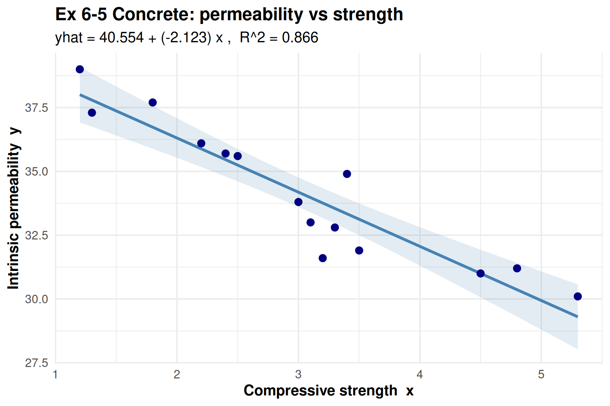
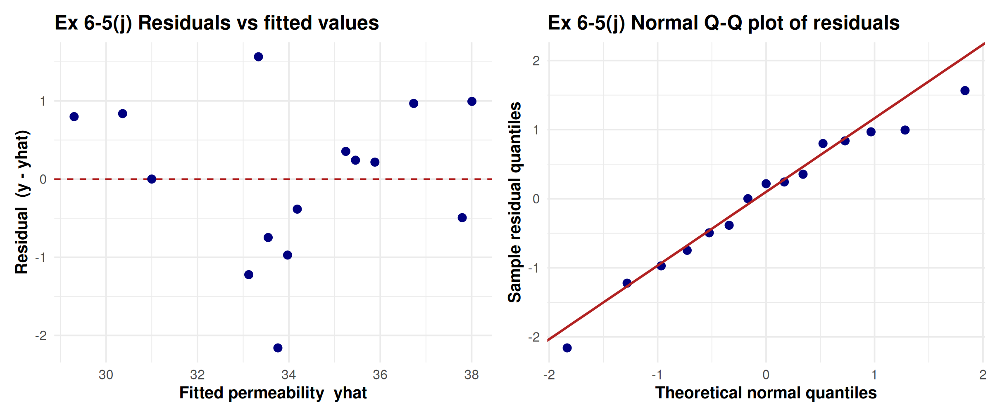
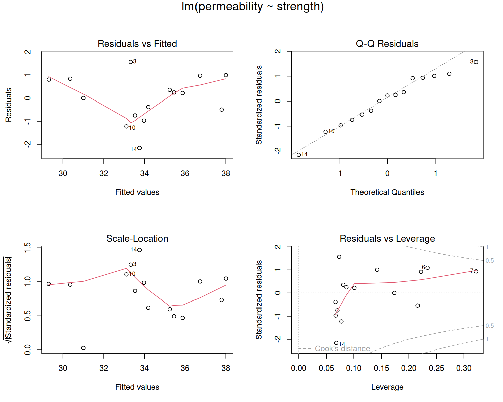
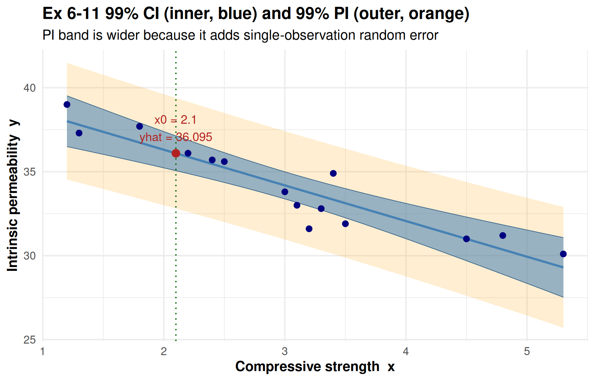

```{r setup, include=FALSE}
knitr::opts_chunk$set(
  echo       = TRUE,
  warning    = FALSE,
  message    = FALSE,
  fig.width  = 6.5,
  fig.height = 4.0,
  fig.align  = "center",
  out.width  = "82%",
  collapse   = TRUE,
  comment    = "#>",
  results    = "hold",
  tidy       = FALSE,
  fig.pos    = "H"
)
knitr::read_chunk("Homework_Assignments_3_solution.R")
```

```{r init, include=FALSE}
```

\newpage

# 報告概述 / Overview

這次作業出自 Montgomery 教科書第 6 章 *Simple Linear Regression*，共兩題：
Exercise 6-5 與 6-11。資料是某混凝土研究裡 15 筆觀測，自變數是 compressive
strength（$x$），反應變數是 intrinsic permeability（$y$），模型為

$$
y = \beta_0 + \beta_1 x + \varepsilon .
$$

- **Exercise 6-5 (a)-(k)**：估計係數、殘差、$SS_E$ 與變異數、係數標準誤、
  $SS_T = SS_R + SS_E$ 分解、$R^2$、係數 $t$ 檢定、ANOVA $F$ 檢定、95% CI、
  模型適合度診斷、樣本相關係數檢定。
- **Exercise 6-11 (a)-(d)**：在 $x_0 = 2.1$ 求平均反應、99% CI、99% PI，並比較
  兩個區間的寬度。

依助教規定，過程數值算到第三位、最終答案四捨五入到第三位。套件載入與共用設定
（`fmt3`、`print_header`）統一放在腳本最前段；本報告每小題直接呈現該題的統計計算
程式碼與 console 結果，繪圖的 `ggplot` 樣板碼為精簡版面而省略，只保留最終圖檔。

\newpage

# Exercise 6-5

\begin{questionbox}
\textbf{6-5.} An article in \emph{Concrete Research} (``Near Surface Characteristics of Concrete: Intrinsic Permeability,'' Vol. 41, 1989) presented data on compressive strength $x$ and intrinsic permeability $y$ of various concrete mixes and cures. 15 observations are given.

\begin{enumerate}[label=(\alph*),topsep=2pt,itemsep=0pt]
\item Estimate the intercept $\beta_0$ and slope $\beta_1$. Write the estimated regression line.
\item Compute the residuals.
\item Compute $SS_E$ and estimate the variance.
\item Find the standard error of the estimated slope and intercept coefficients.
\item Show that $SS_T = SS_R + SS_E$.
\item Compute the coefficient of determination $R^2$. Comment on the value.
\item Use a $t$-test for significance of the intercept and slope at $\alpha = 0.05$. Give the $P$-values and comment.
\item Construct the ANOVA table and test for significance of regression using the $P$-value. Relate to part (g).
\item Construct 95\% CIs on the intercept and slope. Relate to parts (g) and (h).
\item Perform model adequacy checks. Does the model fit adequately?
\item Compute the sample correlation coefficient and test for its significance at $\alpha = 0.05$. Relate to (g) and (h).
\end{enumerate}
\end{questionbox}

## 資料輸入與模型配適

```{r data}
```

```{r fit}
```

```{r ex6_5_scatter-fig, echo=FALSE, out.width="78%", fig.cap="Ex 6-5 散布圖與最小平方回歸線（含 95\\% 平均反應信賴帶）。X 軸為 compressive strength $x$、Y 軸為 intrinsic permeability $y$；負斜率對應 $\\hat\\beta_1 = -2.123$。"}

```

## (a)-(d) 估計、殘差、$SS_E$、變異數、標準誤

```{r ex6_5_abcd}
```

## (e)-(h) 平方和分解、$R^2$、$t$ 檢定、ANOVA

```{r ex6_5_efgh}
```

## (i) 係數的 95% 信賴區間

```{r ex6_5_i}
```

## (j) 模型適合度診斷

```{r ex6_5_j}
```

```{r ex6_5_j-fig, echo=FALSE, out.width="98%", fig.cap="Ex 6-5(j) 殘差診斷。左：殘差對 fitted（檢查線性與等變異），點圍繞 0 無明顯曲度或喇叭口。右：殘差 Normal Q-Q（檢查常態），點貼合參考線。"}

```

```{r ex6_5_j-fig2, echo=FALSE, out.width="82%", fig.cap="Ex 6-5(j) 標準 lm 四連圖：Residuals vs Fitted、Normal Q-Q、Scale-Location、Residuals vs Leverage。"}

```

## (k) 樣本相關係數與檢定

```{r ex6_5_k}
```

\begin{answerbox}
\begin{itemize}
\item \textbf{(a)} $\hat\beta_0 = 40.554$、$\hat\beta_1 = -2.123$；回歸線 $\hat y = 40.554 - 2.123\,x$。
\item \textbf{(b)} 殘差見上方殘差表（每筆 $e_i = y_i - \hat y_i$），最大正殘差在 Obs 3（$+1.565$）、最大負殘差在 Obs 14（$-2.159$）。
\item \textbf{(c)} $SS_E = 13.999$（$df = 13$）；$\hat\sigma^2 = MSE = 1.077$，殘差標準誤 $\hat\sigma = 1.038$。
\item \textbf{(d)} $SE(\hat\beta_0) = 0.751$、$SE(\hat\beta_1) = 0.231$。
\item \textbf{(e)} $SS_T = 104.757 = SS_R + SS_E = 90.759 + 13.999$，分解成立。
\item \textbf{(f)} $R^2 = 0.866$，strength 解釋了 permeability 約 86.6\% 的變異，配適度高。
\item \textbf{(g)} 截距 $t = 54.004$（$P \approx 1.11\times10^{-16}$）、斜率 $t = -9.181$（$P \approx 4.805\times10^{-7}$），都 $< 0.05$，兩係數皆顯著。
\item \textbf{(h)} ANOVA $F = 84.285$、$P \approx 4.805\times10^{-7} < 0.05$，回歸顯著；且 $F = 84.285 = (-9.181)^2 = t_{\text{slope}}^2$，與 (g) 等價。
\item \textbf{(i)} 95\% CI：$\beta_0 \in [38.931, 42.176]$、$\beta_1 \in [-2.623, -1.624]$，都不含 0，與 (g)(h) 一致。
\item \textbf{(j)} 線性、常態（Shapiro-Wilk $p = 0.843$）、等變異（Breusch-Pagan $p = 0.770$）都通過，無顯著離群（Obs 14 Bonferroni $p = 0.359$）、無高 Cook's distance。因 $n = 15$ 偏小不過度宣稱，整體模型配適\textbf{足夠}。
\item \textbf{(k)} $r = -0.931$，$t = -9.181$、$P \approx 4.805\times10^{-7} < 0.05$，顯著負相關；$r^2 = 0.866 = R^2$，且與 (g)(h) 的 slope/regression 檢定結論、$P$-value 完全一致。
\end{itemize}
\end{answerbox}

\newpage

# Exercise 6-11

\begin{questionbox}
\textbf{6-11.} Consider the data and simple linear regression model in Exercise 6-5.

\begin{enumerate}[label=(\alph*),topsep=2pt,itemsep=0pt]
\item Find the mean permeability given that the strength is 2.1.
\item Compute a 99\% CI on this mean response.
\item Compute a 99\% PI on a future observation when the strength is equal to 2.1.
\item What do you notice about the relative size of these two intervals? Which is wider and why?
\end{enumerate}
\end{questionbox}

```{r ex6_11}
```

```{r ex6_11-fig, echo=FALSE, out.width="80%", fig.cap="Ex 6-11 沿著 strength 的 99\\% CI（內層藍帶）與 99\\% PI（外層橘帶）。綠點線標出 $x_0 = 2.1$，紅點為點估計 $\\hat y = 36.095$。PI 帶明顯比 CI 帶寬。"}

```

\begin{answerbox}
\begin{itemize}
\item \textbf{(a)} 在 $x_0 = 2.1$，平均反應 $\hat\mu_{Y\mid x_0} = 40.554 - 2.123 \times 2.1 = 36.095$。
\item \textbf{(b)} 99\% CI（mean response）：$[35.059,\ 37.131]$，寬度 $2.073$。
\item \textbf{(c)} 99\% PI（future observation）：$[32.802,\ 39.388]$，寬度 $6.586$。
\item \textbf{(d)} PI（寬 $6.586$）比 CI（寬 $2.073$）寬。因為 CI 只含平均反應的估計不確定性，PI 還要再加上單一未來觀測本身的隨機誤差 $\varepsilon$（多了 $\hat\sigma^2$ 一項），所以區間更寬。
\end{itemize}
\end{answerbox}

\newpage

# 結語 / Closing Notes

幾個這次有特別留意的點：

- **資料原樣保留**：15 筆 strength / permeability 照題目順序 hard-code，沒有改動。
- **三個檢定一致**：simple linear regression 裡 slope $t$ 檢定、回歸 ANOVA $F$ 檢定、
  相關係數檢定結論相同；數值上驗證了 $F = t^2 = 84.285$、$r^2 = R^2 = 0.866$、三者
  $P$-value 都是 $4.805\times10^{-7}$。
- **平方和分解**：$SS_T = SS_R + SS_E$ 用數值核對過，只有四捨五入層級差異。
- **CI 與 PI 的差別**：6-11 的 PI 比 CI 寬，是因為 PI 多算了單一未來觀測的隨機誤差。
- **診斷不過度宣稱**：$n = 15$ 樣本小，常態與等變異檢定大多通過（少數如 Cramer-von
  Mises 例外），但搭配 Q-Q 圖與其餘檢定，仍給出「足夠配適」這個保守結論。
- **精度**：全篇最終答案四捨五入到第三位（助教規定）。

\begin{flushleft}
R 4.5.2 跑完所有計算，繪圖用 \texttt{ggplot2}（散布/殘差/Q-Q/CI-PI 帶）與 base R
\texttt{plot(lm)} 四連圖；模型與檢定用 \texttt{lm}、\texttt{summary}、\texttt{anova}、
\texttt{confint}、\texttt{predict}、\texttt{cor.test}、\texttt{olsrr}、\texttt{car}。
\end{flushleft}
